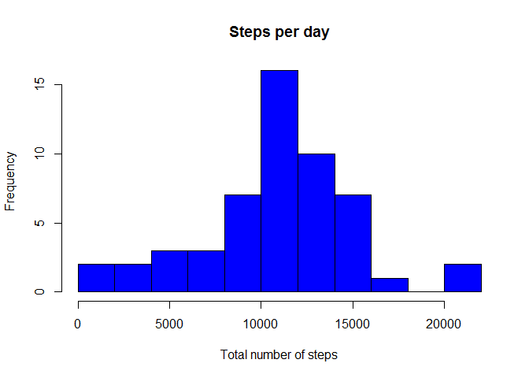

# Reproducible Research: Peer Assessment 1


## Loading the data
Here the data is read from the file to a varible called "data" using read.csv function:

```r
data<-read.csv("activity.csv")
```

## What is mean total number of steps taken per day?
###This is calculated by the following steps:
-Retrieving the dates (as strings) to a vector with unique()  
-constructing a vector "nSteps", for the number of steps of each day.  
-Using a for-loop to go through different dates in the "date"-vector and subsetting the steps-column of the date frame to count the total number of steps for each day using the sum-function.

```r
dates<-unique(data$date)
nSteps<-integer()

for(i in 1:length(dates)){
	good<-data$date==dates[i]	  
	nSteps[i]<-sum(data$steps[good])
	}
```
Here is plotted a histogram of the number of steps per day:

```r
hist(nSteps,main="Steps per day",
     xlab="Total number of steps",
     col="blue",breaks=15)
```

 

The following chunk of code calculates the mean and the median of the steps per day. Notice that in both mean() and median() the na.rm option is set "TRUE". This is because the nSteps vector contains NA values since they were ignored. Without the na.rm option both mean() and median() return NA's.

```r
mean<-mean(nSteps,na.rm=TRUE)
mean<-format(mean,scientific=FALSE)
median<-median(nSteps,na.rm=TRUE)
```
The mean for the daily number of steps is 10766.19   and the median is 10765. Format function was used in the previous code to make the value of the mean display nicely here.

## What is the average daily activity pattern?

Here a time series plot with the intervals on the x-axis 
and the average steps per each the 5 minute intervals (averaging over all the days) is made to show the daily activity pattern:  
-First the unique intervals are retrived  
-Second, a vector for the total number of the steps over
 all the days on that particular interval is constructed.


```r
intervals<-unique(data$interval)
nSteps_int<-integer()
```

The following loop goes through each interval and subsets the "steps" column so that it contains only steps corresponding the desired interval. The steps are calculated using sum(). The na.rm option is applied here because otherwise it would return NA for all elements.

```r
for(i in 1:length(intervals)){
	goodi<-data$interval==intervals[i]
	nSteps_int[i]<-sum(data$steps[goodi],na.rm=TRUE)
}
```

The average amount of steps is calculated by dividing the total number of steps for each interval with the total number of days which is 61.


```r
avg_steps<-nSteps_int/61
```

Next, the time series it plotted using plot with option "type="l"".

```r
plot(intervals,avg_steps,type="l",
     main = "Average number of steps/interval", 
     xlab="Interval", ylab="Avg number of steps")
```

 

There is a clear peak between intervals 500 and 1000 but the exact interval and the maximum can be calculated. The index of the maximum average step count is found by applying which(). This is done in the following:


```r
max_index<-which(avg_steps == max(avg_steps))
max_interval<-intervals[max_index]
```

The maximum average number of steps is in the interval 835.


## Imputing missing values

The total number of NA values in the steps column is easily calculated:

```r
stepnas<-is.na(data$steps)
num_na<-length(data$steps[stepnas])
```
There are 2304 observations with no data.  
Lets complete the data using the average number of steps calculated in the previous section. We create a new data frame as asked and fill the NA's with the averages.


```r
data2<-data
indices<-which(is.na(data$steps)==TRUE)
for (i in length(indices)){
      data2$steps[i]<-avg_steps[i]
}
```

Now the exact same is done to data2 as in the first section for data:


```r
dates2<-unique(data2$date)
nSteps2<-integer()

for(i in 1:length(dates2)){
	good2<-data2$date==dates2[i]	  
	nSteps2[i]<-sum(data2$steps[good2])
	}
```

The corresponding plot is done the same way:


```r
hist(nSteps2,main="Steps per day with NA's filled",
     xlab="Total number of steps",
     col="blue",breaks=15)
```

 

The mean and the median are calculated the same way as in the first case:  

```r
mean2<-mean(nSteps2)
mean2<-format(mean,scientific=FALSE)
median2<-median(nSteps2)
median2<-format(median2,scientific=FALSE)
```
The mean is 10766.19 and the median is NA. There's no difference to what was calculated earlier with the NA's removed. The histograms can not be distinquished either.
## Are there differences in activity patterns between weekdays and weekends?
