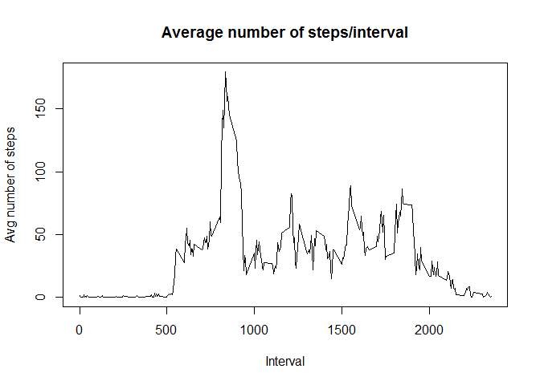
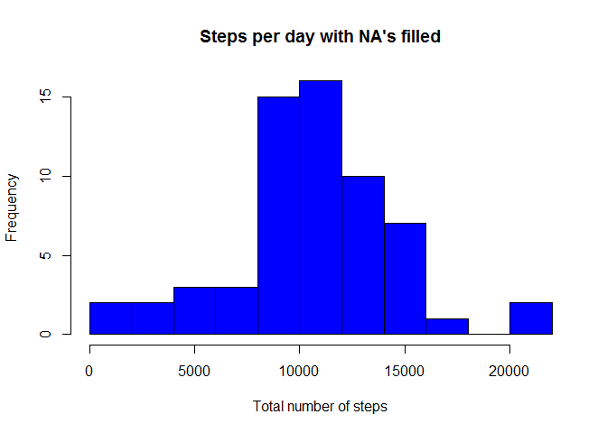

# Reproducible Research: Peer Assessment 1


## Loading the data
Here the data is read from the file to a varible called "data" using read.csv function:

```r
data<-read.csv("activity.csv")
```

## What is mean total number of steps taken per day?
###This is calculated by the following steps:
-Retrieving the dates (as strings) to a vector with unique()  
-constructing a vector "nSteps", for the number of steps of each day.  
-Using a for-loop to go through different dates in the "date"-vector and subsetting the steps-column of the date frame to count the total number of steps for each day using the sum-function.

```r
dates<-unique(data$date)
nSteps<-integer()

for(i in 1:length(dates)){
	good<-data$date==dates[i]	  
	nSteps[i]<-sum(data$steps[good])
	}
```
Here is plotted a histogram of the number of steps per day:

```r
hist(nSteps,main="Steps per day",
     xlab="Total number of steps",
     col="blue",breaks=15)
```

 

The following chunk of code calculates the mean and the median of the steps per day. Notice that in both mean() and median() the na.rm option is set "TRUE". This is because the nSteps vector contains NA values since they were ignored. Without the na.rm option both mean() and median() return NA's.

```r
mean<-mean(nSteps,na.rm=TRUE)
mean<-format(mean,scientific=FALSE)
median<-median(nSteps,na.rm=TRUE)
```
The mean for the daily number of steps is 10766.19   and the median is 10765. Format function was used in the previous code to make the value of the mean display nicely here.

## What is the average daily activity pattern?

Here a time series plot with the intervals on the x-axis 
and the average steps per each the 5 minute intervals (averaging over all the days) is made to show the daily activity pattern:  
-First the unique intervals are retrived  
-Second, a vector for the total number of the steps over
 all the days on that particular interval is constructed.


```r
intervals<-unique(data$interval)
nSteps_int<-integer()
```

The following loop goes through each interval and subsets the "steps" column so that it contains only steps corresponding the desired interval. The steps are calculated using sum(). The na.rm option is applied here because otherwise it would return NA for all elements.

```r
for(i in 1:length(intervals)){
	goodi<-data$interval==intervals[i]
	nSteps_int[i]<-sum(data$steps[goodi],na.rm=TRUE)
}
```

The average amount of steps is calculated by dividing the total number of steps for each interval with the total number of days which is 61.


```r
avg_steps<-nSteps_int/61
```

Next, the time series it plotted using plot with option "type="l"".

```r
plot(intervals,avg_steps,type="l",
     main = "Average number of steps/interval", 
     xlab="Interval", ylab="Avg number of steps")
```

 

There is a clear peak between intervals 500 and 1000 but the exact interval and the maximum can be calculated. The index of the maximum average step count is found by applying which(). This is done in the following:


```r
max_index<-which(avg_steps == max(avg_steps))
max_interval<-intervals[max_index]
```

The maximum average number of steps is in the interval 835.


## Imputing missing values

The total number of NA values in the steps column is easily calculated:

```r
stepnas<-is.na(data$steps)
num_na<-length(data$steps[stepnas])
```
There are 2304 observations with no data.  
Lets complete the data using the average number of steps calculated in the previous section. We create a new data frame as asked and fill the NA's with the averages.


```r
data2<-data
indices<-which(is.na(data$steps)==TRUE)
for (i in 1:length(indices)){
      data2$steps[indices[i]]<-rep(cbind(avg_steps,avg_steps),61)[i]
}
```

Now the exact same is done to data2 as in the first section for data:


```r
dates2<-unique(data2$date)
nSteps2<-integer()

for(i in 1:length(dates2)){
	good2<-data2$date==dates2[i]	  
	nSteps2[i]<-sum(data2$steps[good2])
	}
```

The corresponding plot is done the same way:


```r
hist(nSteps2,main="Steps per day with NA's filled",
     xlab="Total number of steps",
     col="blue",breaks=15)
```

 

The mean and the median are calculated the same way as in the first case:  

```r
mean2<-mean(nSteps2)
mean2<-format(mean,scientific=FALSE)
median2<-median(nSteps2)
median2<-format(median2,scientific=FALSE)
```
The mean is 10766.19 and the median is 10395. There's no difference between the means, but the median is smaller than what was calculated earlier. The histograms looks different also.  

## Are there differences in activity patterns between weekdays and weekends?
To get the weekdays for distinguishing the weekdays and weekends, function "weekdays" is needed. Also, the variable date in the data needs to be converted into POSIxlt using function strptime. strptime is given two parameters: the date column (the values are converted from factor into character strings using as.character), and a format (a regular expression) indicating which parts are the year, month and day. Note that the data with the filled in values (NA's replaced with means, data2) is used here:


```r
data2$date<-strptime(as.character(data2$date), "%Y-%m-%d")
```

To get the day names from weekdays() in english, I need to set the locale using the following command:


```r
Sys.setlocale("LC_TIME", "English")
```

```
## [1] "English_United States.1252"
```

Next a factor variable indicating whether the date is a weekday or weekend is created using a simple comparison if the day given by function weekdays is  either Saturday or Sunday or not:


```r
data2$period<-ifelse(weekdays(data2$date)=="Saturday"
		|weekdays(data2$date)=="Sunday","Weekend","Weekday")
data2$period<-factor(data2$period)
```

Then the average step amounts for each interval are calculated for the filled data. We subset the data according whether the date is on a weekday or weekend and calculate the averages for both separately.


```r
avg_steps_int_wd<-integer()

for(i in 1:length(intervals)){
	goodi<-(data2$interval==intervals[i]
	        &data2$period=="Weekday")
	avg_steps_int_wd[i]<-mean(data2$steps[goodi])
}

avg_steps_int_wknd<-integer()

for(i in 1:length(intervals)){
	goodi<-(data2$interval==intervals[i]
	        &data2$period=="Weekend")
	avg_steps_int_wknd[i]<-mean(data2$steps[goodi])
}
```

Next the data needs to be formed into a new data frame to make it easier to plot. To do this, first the vectors need to be forced into column form and new vectors need to be constructed. The idea is to put data of the weekdays on the first rows, and of the weekends to the last ones. This way, it is easy to later add a factor column to group the values. Also, the intervals are added twice, because the order of them for the average steps calculated earlier is the same. Therefore it is known the each row has the right label for the interval and the period (week or weekend). There are equally many means for both, so it is known that the number of rows is twice the number of the unique intervals. 


```r
avg_steps_int_wd<-cbind(avg_steps_int_wd)
avg_steps_int_wknd<-cbind(avg_steps_int_wknd)
interval<-cbind(unique(intervals))
avg_steps<-rbind(avg_steps_int_wd,avg_steps_int_wknd)
interval<-cbind(unique(interval))
interval<-rbind(interval,interval)
```

Then, a data frame is constructed for the plotting. Also, a third column is added to group the intervals and the columns are named properly:


```r
meansteps<-cbind(interval,avg_steps)
meansteps<-data.frame(meansteps)
weekday<-cbind(rep("weekday",length(intervals)))
weekend<-cbind(rep("weekend",length(intervals)))
meansteps$period<-factor(rbind(weekday,weekend))
names(meansteps)[1:2]<-c("Interval","Average_Steps")
```

The next code plots the average number of steps for each interval. The averages are plotted separately for weekdays and weekends in different panels and the period factor is used for this. The lattice library need to be loaded first:


```r
library(lattice)
xyplot(Average_Steps~Interval|period,data=meansteps,
      type="l",layout=c(1,2),
      xlab="Interval",ylab="Number of Steps")
```

 

The figures show, that the activity patterns look different during the weekends than during the weeks. It seems that the number of steps taken is more uniformly distributed throughout the day on weekends. There is a peak in the morning in the steps taken on the weekdays.


